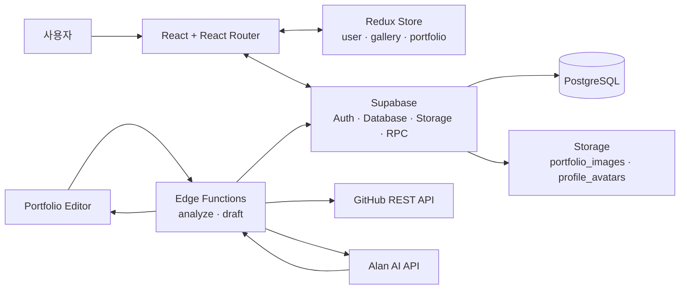
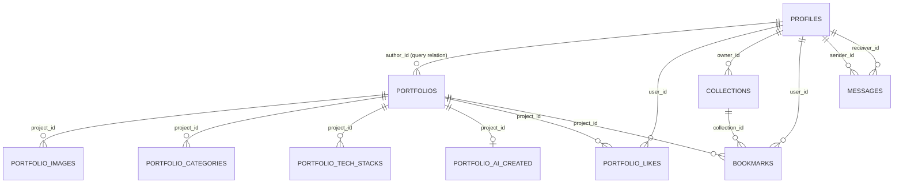
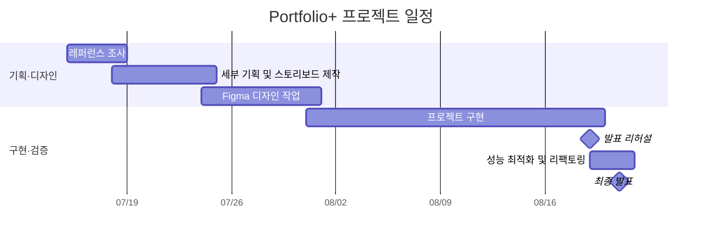

# Portfolio+

> **Discover Works, Connect Possibilities.**

개발자·디자이너가 프로젝트를 전시하고, 다른 사용자가 작업물을 탐색하며 작성자와 연결될 수 있도록 만든 포트폴리오 갤러리 플랫폼입니다. 프로젝트의 설명·기술 스택·배포/저장소 링크를 한곳에서 확인하고, 공개 프로필을 통해 작성자의 다른 작업을 살펴볼 수 있습니다. 관심 프로젝트는 북마크와 컬렉션으로 관리하며, 작성자에게 메시지도 보낼 수 있습니다. 포트폴리오 작성 과정에서는 GitHub 저장소 정보를 바탕으로 AI 분석과 소개 초안 생성을 지원합니다.

## 1. 프로젝트 소개

Portfolio+는 흩어진 개인 프로젝트를 단순 링크 모음이 아닌 **탐색·전시·연결 가능한 포트폴리오 데이터**로 다루는 서비스입니다.

- 작성자는 프로젝트 기본 정보, 참여 방식, 카테고리, 기술 스택, 이미지, 링크를 등록·수정하고 공개 여부를 제어합니다.
- 방문자는 공개 프로젝트를 갤러리에서 검색·필터링·정렬하고 상세 정보와 작성자 프로필을 확인합니다.
- 관심 프로젝트는 컬렉션에 담고, 공개 프로필의 작성자에게 메시지를 전송할 수 있습니다.
- GitHub 저장소의 메타데이터·README·언어·커밋·파일 트리를 수집해 AI 분석 결과를 프로젝트 소개에 활용할 수 있습니다.

## 2. 팀원 소개 및 역할

아래 역할은 저장소의 커밋 및 PR 이력에서 확인되는 작업 범위를 기준으로 정리했습니다. 실명 또는 개인 GitHub 주소가 이력만으로 확정되지 않는 경우 계정명/플레이스홀더로 표기했습니다.

| 팀원   | 역할                  | 주요 담당                                                                            | GitHub                               |
| ------ | --------------------- | ------------------------------------------------------------------------------------ | ------------------------------------ |
| 배정호 | 포트폴리오 에디터·AI  | 라우팅, Supabase 연동, 프로젝트 등록/수정, 이미지 관리, GitHub/AI Edge Function, SEO | [https://github.com/raspbsb]         |
| 유태구 | 포트폴리오 상세·Home  | 프로젝트 상세 화면, Hero/AI/작성자 섹션, 반응형 UI, Home                             | [https://github.com/rozer4heros]     |
| 맹예진 | MyPage·Public Profile | 프로필/활동 통계, 컬렉션·북마크, 메시지·알림 UI, 모바일 프로필 내비게이션            | [https://github.com/rkskek8484-cell] |
| 오예은 | 인증 화면             | 로그인·회원가입 화면 및 반응형 스타일, 헤더 보완                                     | [https://github.com/dhdpdms0712-oss] |
| 강채희 | Gallery               | 갤러리 UI, 목록 조회·검색·필터·반응형 카드 처리                                      | [https://github.com/chae3110]        |

## 3. 주요 기능

### 인증

- Supabase Auth 기반 이메일/비밀번호 회원가입과 로그인
- Redux `user` slice 및 `onAuthStateChange`로 로그인 사용자/프로필 상태 동기화
- 회원가입 시 선택한 프로필 이미지를 `profile_avatars` Storage 버킷에 업로드하고 `profiles` 행 생성
- 포트폴리오 작성·수정 화면 진입 시 인증 여부 확인 및 로그인 화면 리다이렉트

> GitHub OAuth 연결을 위한 헬퍼는 있으나, 현재 에디터의 연결·소유자 대조 흐름은 주석 처리되어 있습니다. 따라서 소셜 로그인 또는 GitHub 계정 연결을 현재 제공 기능으로 기재하지 않습니다.

### Home · Gallery

- Home에서 최신 포트폴리오 최대 12개를 조회하고 제목·AI 요약·설명 기준으로 검색
- Gallery에서 좋아요 수 기준 추천 포트폴리오 4개와 전체 공개 포트폴리오 제공
- 제목 검색(300ms debounce), 기술 스택 필터, 최신/조회 수/좋아요 수 정렬, 더보기(초기 8개 이후 4개 추가)
- 공개 프로젝트만 조회하고, 카드에서 썸네일·기술 스택·작성자·조회 수를 노출
- MUI breakpoint 기반 반응형 Grid 및 카드 데이터 누락 방어 처리

### Portfolio Editor

- 프로젝트명, 설명, 기간, 배포/저장소 URL, 참여 형태·규모·역할·진행 환경, 공개 여부 입력
- 카테고리와 기술 스택 선택, `Autocomplete` 및 `freeSolo` 직접 입력
- 이미지 첨부, 대표 이미지 지정, 순서 변경, 드래그 앤 드롭 정렬·업로드·삭제
- 등록/수정 시 `portfolios`와 카테고리·기술 스택·이미지·AI 결과를 분리 저장
- 로컬 임시저장, 저장 전 폼 검증, 작성 중 새로고침/뒤로 가기 이탈 확인 Dialog
- GitHub 저장소 분석과 AI 소개 초안 생성, 분석/초안별 서버 쿨다운 처리
- 수정 화면에서 존재 여부와 현재 사용자 작성자 여부를 확인

### Portfolio Detail

- Hero, 프로젝트 메타데이터, 카테고리/기술 스택, 설명, 배포·저장소 외부 링크 제공
- 조회 수 증가 RPC, 좋아요 토글 및 북마크/컬렉션 저장
- AI 짧은 요약, 분석 결과, 분석 근거 표시
- 동일 작성자의 다른 공개 프로젝트 최대 2개 노출
- 비공개 프로젝트는 작성자 본인 외 접근 시 안내 화면 표시

### MyPage · Public Profile

- 프로필 이미지, 이름, 직군, 자기소개, 이메일, GitHub/외부 링크, 기술 스택 수정
- 내 프로젝트, 북마크 컬렉션, 관심 및 연락 탭 제공
- 공개 프로필(`/profiles/:userId`)에서 다른 사용자의 공개 프로젝트만 조회
- 프로젝트 수, 받은 좋아요, 받은 연락, 프로필 조회 수 활동 통계 표시
- 프로필의 활동 내역 공개 설정(`profiles.is_public`)이 꺼진 경우 Public Profile 통계를 잠금 표시
- 메시지 작성·조회·읽음 처리·삭제, 받은 좋아요와 메시지를 결합한 알림 목록
- 데스크톱 탭 및 모바일 프로필 내비게이션

**차이점:** MyPage는 로그인한 본인의 프로필을 편집하고 전체 프로젝트·컬렉션을 관리하는 공간입니다. Public Profile은 수정 기능이 없으며, 타인 방문 시 공개 프로젝트만 노출합니다. 활동 통계는 작성자가 공개한 경우에만 숫자를 보여 줍니다.

### Bookmark · Collection · Contact

- 프로젝트별 좋아요와 북마크, 북마크 시 컬렉션 선택
- 컬렉션 생성·수정·삭제 및 컬렉션별 북마크 프로젝트 조회(생성 UI에서 최대 8개 제한)
- 컬렉션이 없을 때 Empty State와 컬렉션 페이지 이동 링크 제공
- 받은 메시지와 내 프로젝트의 좋아요를 시간순으로 확인, 메시지 읽음·삭제 처리

## 4. 주요 화면 / 페이지 구성

```text
/
├── Home
├── /gallery                         Gallery
├── /portfolios/new                  Portfolio Editor (new)
├── /portfolios/:id                  Portfolio Detail
├── /portfolios/:id/edit             Portfolio Editor (edit)
├── /login                           Login
├── /signup                          Signup
├── /mypage                          MyPage Profile
│   ├── /mypage/projects             My Projects
│   ├── /mypage/collections          Collections
│   └── /mypage/collections/:id      Collection Projects
├── /profiles/:userId                Public Profile / Public Projects
└── *                                Not Found
```

## 5. 기술 스택

| 기술                           | 용도                                                          |
| ------------------------------ | ------------------------------------------------------------- |
| React 19                       | 컴포넌트 기반 SPA UI                                          |
| Vite                           | 개발 서버 및 프로덕션 번들링                                  |
| React Router DOM 7             | BrowserRouter 기반 페이지 라우팅                              |
| Redux Toolkit / React Redux    | 사용자·갤러리·포트폴리오 전역 상태                            |
| Material UI / Emotion          | UI 컴포넌트, 테마, breakpoint 기반 반응형 UI                  |
| Sass / CSS Modules             | 컴포넌트 스타일링                                             |
| Supabase                       | Auth, PostgreSQL Data API, Storage, RPC, Edge Functions       |
| Supabase Edge Functions / Deno | GitHub 데이터 수집과 AI 분석·초안 생성 서버 로직              |
| GitHub REST API                | 저장소 메타데이터, README, 언어, 커밋, 파일 트리, 기여자 수집 |
| Alan AI API                    | 프로젝트 분석 및 소개 초안 JSON 생성                          |
| @dnd-kit                       | 에디터 이미지 드래그 앤 드롭 정렬                             |
| React Helmet Async             | SEO 메타·canonical·OG 태그                                    |

## 6. 시스템 구조 / 데이터 흐름



일반 화면 데이터는 Supabase 조회 결과를 Redux(갤러리·상세·사용자) 또는 화면 로컬 상태로 반영합니다. 이미지는 Storage에 업로드한 경로를 DB에 보관하고, UI에서 public URL로 변환합니다.

## 7. AI 기능

### GitHub 저장소 분석

`analyze` Edge Function은 로그인 사용자 요청을 받아 다음 정보를 GitHub REST API에서 병렬 수집합니다.

- 저장소 메타데이터(이름, 설명, 기본 브랜치, 공개 여부, 스타 수)
- README 본문(최대 2,000자), 언어 정보
- 커밋 최대 100개(merge·중복 제목 제외), 파일 트리에서 선별한 최대 30개 경로, 기여자 최대 10명

수집 데이터와 에디터 입력값을 바탕으로 폼 컨텍스트·커밋 배치·구조 분석을 병렬 요청하고, 최종 취합 요청으로 프로젝트 요약, 주요 기능, 기술 특징, 구조, 역할, 한계, 분석 근거 JSON을 생성합니다. 결과는 `portfolio_ai_created`에 저장되어 상세 화면의 AI Summary/근거 영역에 표시됩니다.

### 소개 초안 생성과 안정화

- `draft` Edge Function은 기존 프로젝트 설명과 입력 정보를 바탕으로 설명 초안 및 짧은 요약 JSON을 생성합니다.
- 프롬프트별 900자 예산, README/설명 절단, 커밋의 최근·최초·중간 구간 배치로 입력 크기를 제어합니다.
- Alan API 요청은 30초 `AbortController` timeout을 사용하고, 여러 `ALAN_API_KEYS`를 순차 재시도합니다.
- 코드 블록/부가 문장을 제거한 JSON 파싱과 필수 내용 검증에 실패하면 다음 키를 시도합니다.
- 서버가 성공한 요청에 한해 쿨다운을 기록합니다. 분석은 사용자+저장소 기준 30분, 초안은 사용자 기준 10분입니다. 클라이언트는 서버 응답 메시지를 표시합니다.

> 현재 `analyze` 함수는 유효한 로그인 사용자와 요청 형식, GitHub URL/API 오류를 서버에서 확인합니다. 현행 코드에는 GitHub 계정-저장소 소유자 대조나 `project_id` 기반 포트폴리오 소유자 대조가 포함되어 있지 않으므로, 이를 구현 완료 기능으로 설명하지 않습니다.

## 8. 인증 및 권한 / 보안

- Supabase Auth의 이메일/비밀번호 인증을 사용합니다.
- 에디터 진입과 등록/수정 서비스에서 인증 사용자를 확인하며, 수정 쿼리는 `project_id`와 `author_id`를 함께 조건으로 사용합니다.
- 상세 화면과 Public Profile 프로젝트 조회는 `is_public`을 기준으로 공개 범위를 분리합니다.
- 메시지 삭제는 현재 수신자 ID 조건을 함께 사용하고, 컬렉션/북마크 조회는 로그인 사용자 ID를 기준으로 요청합니다.
- Edge Function은 `withSupabase({ auth: ["user", "publishable", "secret"] })` 및 `ctx.userClaims`로 로그인 사용자를 확인하고, 서버 측 AI 쿨다운을 강제합니다.
- 클라이언트에는 `VITE_SUPABASE_PUBLISHABLE_KEY`만 사용하며, GitHub 토큰과 Alan API 키는 Edge Function 환경 변수로 읽습니다.

**RLS 확인 범위:** 현재 저장소에는 migration 또는 RLS policy SQL이 포함되어 있지 않고 생성된 DB 타입도 빈 스키마입니다. 따라서 bookmarks/collections/messages 등의 실제 RLS 정책 정의는 **확인 필요**입니다. 위 접근 제한 중 일부는 클라이언트 쿼리 조건이므로, 운영 환경에서는 동일 정책을 Supabase RLS로 검증해야 합니다.

## 9. 데이터베이스 구조

저장소에 DB migration/DDL이 없으므로, 아래는 실제 Supabase 쿼리·관계 선택문에서 확인되는 테이블과 **코드 관찰 관계**입니다. PK/FK 제약 조건의 정확한 선언은 확인 필요입니다.

| 테이블                  | 코드에서 확인된 역할                                                                 |
| ----------------------- | ------------------------------------------------------------------------------------ |
| `profiles`              | 사용자 이름, 아바타, 직군, 스킬 배열, 소개, 링크, 활동 공개 여부, 프로필 조회 수     |
| `portfolios`            | 프로젝트 본문, 작성자(`author_id`), 기간, 링크, 참여 정보, 공개 여부, 조회/좋아요 수 |
| `portfolio_images`      | 프로젝트 이미지 경로, 표시 순서, 썸네일 여부, 대체 텍스트                            |
| `portfolio_categories`  | 프로젝트-카테고리 연결                                                               |
| `portfolio_tech_stacks` | 프로젝트-기술 스택 연결                                                              |
| `portfolio_ai_created`  | GitHub 분석, 분석 근거, AI 초안, AI 짧은 요약                                        |
| `portfolio_likes`       | 사용자별 프로젝트 좋아요                                                             |
| `collections`           | 사용자 소유 북마크 컬렉션                                                            |
| `bookmarks`             | 사용자·프로젝트·컬렉션 연결                                                          |
| `messages`              | 발신자, 수신자, 내용, 읽음 여부                                                      |
| `ai_action_cooldowns`   | 사용자·액션·저장소 URL별 마지막 AI 요청 시각                                         |



`increment_portfolio_view`, `increment_profile_view` RPC가 각각 프로젝트·프로필 조회 수 증가에 호출됩니다. 함수 본문과 제약 조건은 저장소에서 확인되지 않습니다.

## 10. 반응형 / UX

- MUI 사용자 정의 breakpoint: mobile 0, tablet 768, desktop 1440px(컨테이너 기준 1272px)
- Gallery·Home·프로필/상세 화면의 breakpoint별 Grid, 여백, 카드 배치
- 모바일 프로필 하단 내비게이션과 데스크톱 탭 내비게이션
- 로딩, Empty State, 오류 안내, Snackbar, Dialog/삭제 확인 Dialog
- Gallery/Home 검색 300ms debounce, Gallery 더보기, MyPage 컬렉션·알림 카드 수 제한
- 카드의 썸네일 누락·관계 데이터 누락에 대한 기본값 처리
- 이미지에 `loading="lazy"` 적용, 외부 링크 새 탭 열기, SEO 메타와 sitemap/robots 파일 제공
- 포트폴리오 에디터의 임시저장·이탈 방지·드래그 앤 드롭 이미지 관리

## 11. 개발 일정 (Milestone)

| 기간        | 단계                         | 주요 내용                                                                                          |
| ----------- | ---------------------------- | -------------------------------------------------------------------------------------------------- |
| 7/15 ~ 7/18 | 레퍼런스 조사                | Behance, Dribbble, GitHub, Pinterest, Cosmos, Awwwards 등 서비스 및 UI/UX 레퍼런스 조사            |
| 7/18 ~ 7/24 | 세부 기획 및 스토리보드 제작 | 서비스 방향 구체화, 사용자 흐름 설계, 기능 정의, 주요 페이지 스토리보드 제작                       |
| 7/24 ~ 7/31 | Figma 디자인 작업            | Desktop 중심 UI 디자인 및 컴포넌트/레이아웃 설계, 반응형 디자인                                    |
| 7/31 ~ 8/19 | 프로젝트 구현                | React + Supabase 기반 개발, 인증, Gallery, Portfolio, AI, MyPage, Public Profile 등 주요 기능 구현 |
| 8/19        | 발표 리허설                  | 프로젝트 전체 기능 시연 및 발표 리허설                                                             |
| 8/19 ~ 8/21 | 성능 최적화 및 리팩토링      | Lighthouse 기반 성능/SEO 개선, 이미지 lazy loading, 코드 정리, RLS 적용, 보안 및 최종 버그 점검    |
| 8/21        | 최종 발표                    | 프로젝트 최종 결과 발표 및 시연                                                                    |

### Milestone Timeline



> 일정 표에 연도가 명시되지 않아, 저장소 Git 이력의 작업 연도(2026)를 타임라인 표기에만 사용했습니다. 기간과 단계·내용은 위 일정표의 원문을 그대로 따릅니다.

## 12. 실행 방법

프런트엔드 실행 위치는 프로젝트 루트가 아닌 `app/`입니다.

```bash
git clone https://github.com/raspbsb/EST_FE_13_3rd_Project.git
cd EST_FE_13_3rd_Project/app
npm install
npm run dev
```

```bash
# 프로덕션 빌드 및 미리 보기
npm run build
npm run preview

# 린트
npm run lint
```

Supabase 로컬 환경과 Edge Function은 루트에서 실행합니다.

```bash
npm install
npm run supabase:start
npm run functions:serve
```

로컬 함수 실행은 `supabase/.env.local`을 사용하도록 루트 `package.json`에 설정되어 있습니다. Supabase CLI 및 Docker 등 로컬 Supabase 실행 선행 조건은 별도로 준비해야 합니다.

## 13. 환경 변수

값은 저장소에 포함하지 않습니다. `.env.example` 파일은 현재 확인되지 않았습니다.

| 위치                  | 변수                            | 용도                                                            |
| --------------------- | ------------------------------- | --------------------------------------------------------------- |
| `app/.env.local`      | `VITE_SUPABASE_URL`             | Vite 클라이언트의 Supabase URL                                  |
| `app/.env.local`      | `VITE_SUPABASE_PUBLISHABLE_KEY` | Vite 클라이언트의 Supabase publishable key                      |
| `app/.env.local`      | `VITE_SITE_URL`                 | canonical/OG URL의 사이트 기준 주소(미설정 시 placeholder 사용) |
| `supabase/.env.local` | `GITHUB_TOKEN`                  | Edge Function의 GitHub REST API 요청                            |
| `supabase/.env.local` | `ALAN_API_KEYS`                 | 쉼표로 구분한 Alan AI API key 목록                              |

## 14. 배포

- 프런트엔드 구성은 Vite SPA이며, Git 이력에는 Vercel의 deep link 새로고침 404를 해결하기 위해 `app/vercel.json` rewrite를 추가한 커밋이 남아 있습니다.
- 다만 **현재 체크아웃된 저장소에는 `vercel.json`이 존재하지 않으며 배포 URL도 확인되지 않습니다.** 배포 시에는 Vercel 프로젝트의 Root Directory를 `app`으로 지정하고, 아래 SPA rewrite 설정이 배포 대상에 존재하는지 확인이 필요합니다.

```json
{
  "rewrites": [{ "source": "/(.*)", "destination": "/index.html" }]
}
```

배포 URL: **확인 필요**

## 15. 프로젝트 진행 중 주요 기술적 해결 사항

Git 커밋/PR 이력과 현행 코드에서 함께 확인되는 작업을 정리했습니다.

### AI 분석 응답 안정화

**문제:** GitHub 분석 중 AI API의 timeout, 502/504 계열 오류, 비JSON 또는 비어 있는 응답이 발생할 수 있었습니다.

**해결:** 요청별 30초 abort timeout, 다중 API key 순차 시도, JSON 추출/파싱 및 내용 검증, GitHub 오류 상태별 응답을 Edge Function에 구현했습니다. 프롬프트는 900자 예산과 커밋 배치로 크기를 제한했습니다.

**결과:** 실패 원인을 구분해 사용자에게 전달하고, 유효한 JSON 결과가 나올 때까지 다음 키로 재시도할 수 있게 됐습니다.

### 서버 기준 AI 쿨다운

**문제:** 클라이언트 버튼 비활성화만으로는 직접 함수 호출을 통한 반복 요청을 막을 수 없습니다.

**해결:** `ai_action_cooldowns`에 마지막 성공 요청을 upsert하고 Edge Function 진입 시 검사했습니다. 분석은 사용자+저장소, 초안은 사용자 단위로 쿨다운을 적용하며, 남은 시간은 서버가 계산합니다.

**결과:** UI 우회 여부와 관계없이 AI 요청 빈도를 서버에서 제어하고, 클라이언트의 시간과 서버 기준을 일치시켰습니다.

### Gallery 탐색성 및 카드 예외 처리

**문제:** 검색 입력마다 즉시 조회하면 불필요한 요청이 발생하고, 기술 스택/이미지/좋아요 관계 데이터의 형식 차이로 카드가 깨질 수 있었습니다.

**해결:** 300ms debounce, 공개 프로젝트 조건, 기술 스택 라벨 정규화, 썸네일·좋아요 수의 fallback을 적용했습니다. 페이지네이션은 초기 조회와 추가 조회 thunk로 분리했습니다.

**결과:** 검색 중 요청 수를 줄이고, 데이터가 일부 비어 있어도 목록 렌더링을 유지하도록 했습니다.

### Public Profile의 공개 범위 분리

**문제:** 내 프로필 관리 화면과 타인에게 공개하는 화면은 데이터 범위와 편집 권한이 달라야 합니다.

**해결:** `/mypage`와 `/profiles/:userId` 레이아웃을 분리하고, Public Profile의 타인 조회에는 `is_public = true` 조건을 적용했습니다. 활동 내역 비공개 설정 시 통계는 잠금 표시합니다.

**결과:** 본인 관리 UX와 외부 공개 UX를 구분했습니다. DB 수준 정책은 migration 부재로 별도 확인이 필요합니다.

### SPA deep link 및 성능/SEO 보완

**문제:** SPA의 상세 경로를 새로고침하면 호스팅 환경에서 404가 발생할 수 있고, 페이지 메타·이미지 로딩 최적화가 필요했습니다.

**해결:** Git 이력에서 Vercel rewrite 설정을 추가했고, `SeoMeta`, sitemap/robots, 이미지 lazy loading을 반영했습니다.

**결과:** 이력상 deep link 배포 설정과 기본 SEO/이미지 로딩 개선이 추가됐습니다. 단, 현 브랜치의 `vercel.json` 존재 여부는 배포 전 확인해야 합니다.

## 16. 회고 / 프로젝트 특징

- React SPA에서 Supabase Auth·DB·Storage·RPC·Edge Function을 연결해 포트폴리오 등록부터 탐색·연락까지의 흐름을 구성했습니다.
- 포트폴리오 본문과 이미지/카테고리/기술 스택/AI 결과를 분리해 저장하고, 수정 시 연결 데이터를 교체·upsert하는 흐름을 구현했습니다.
- 외부 GitHub 데이터와 AI API를 서비스에 연결하면서 timeout, key fallback, JSON 검증, 서버 기반 쿨다운 같은 실패 대응을 코드화했습니다.
- MyPage와 Public Profile을 분리하고 공개 프로젝트·활동 통계 노출을 제어해 공개 데이터 UX를 설계했습니다.
- Git 이력에서 Gallery 반응형, 메시지·컬렉션 Empty State, 이미지 드래그 앤 드롭, SEO/lazy loading, SPA rewrite를 반복적으로 개선한 과정이 확인됩니다.

---

## 최종 점검 기록

- 프로젝트명과 슬로건: `Portfolio+` / `Discover Works, Connect Possibilities.`
- 라우트, 패키지, Supabase 함수, Storage 버킷, 환경 변수, Git 이력을 현 저장소 기준으로 대조했습니다.
- DB migration/RLS SQL, 현재 `vercel.json`, 실제 배포 URL, 확정되지 않은 개인 GitHub 링크는 추측하지 않고 **확인 필요** 또는 플레이스홀더로 표시했습니다.
